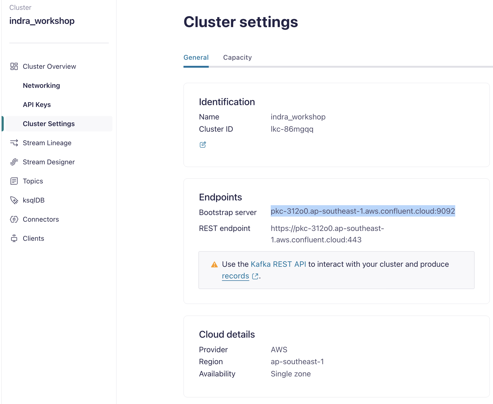
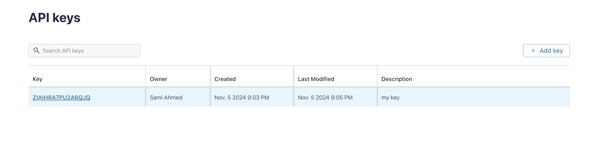
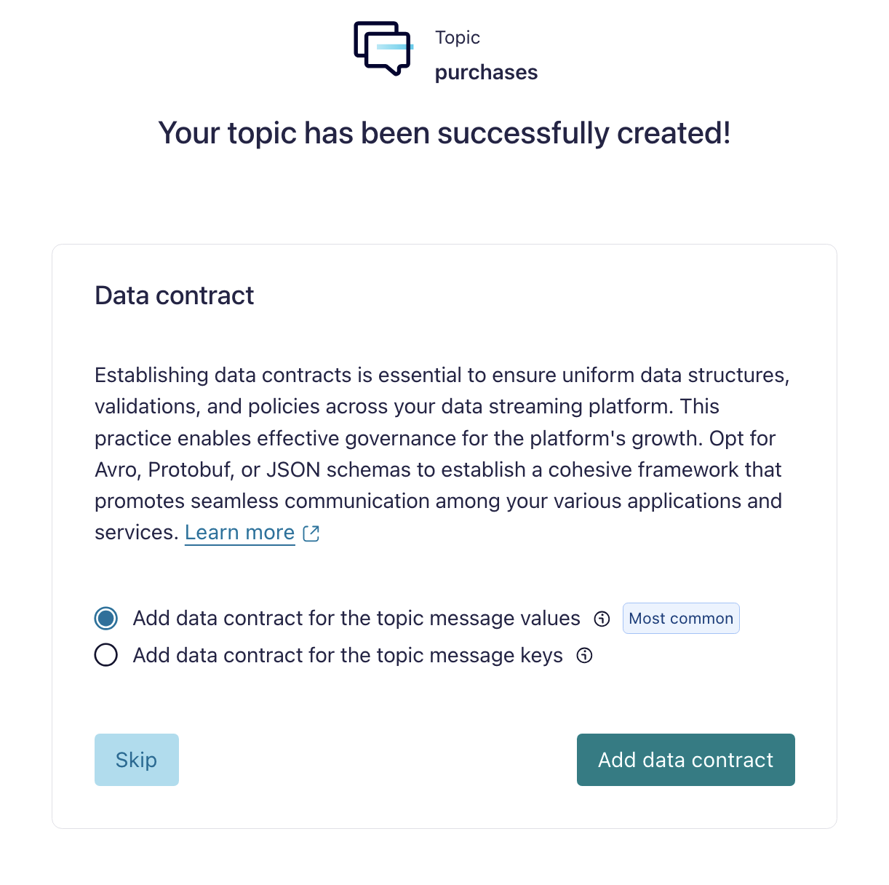
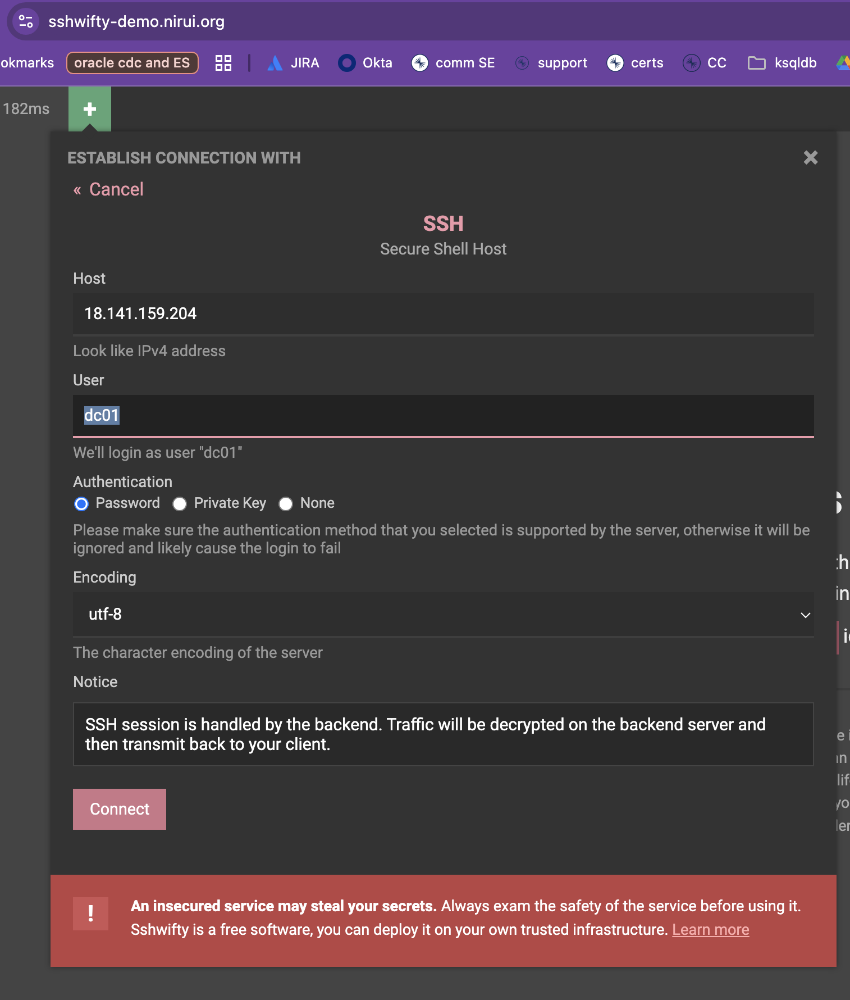
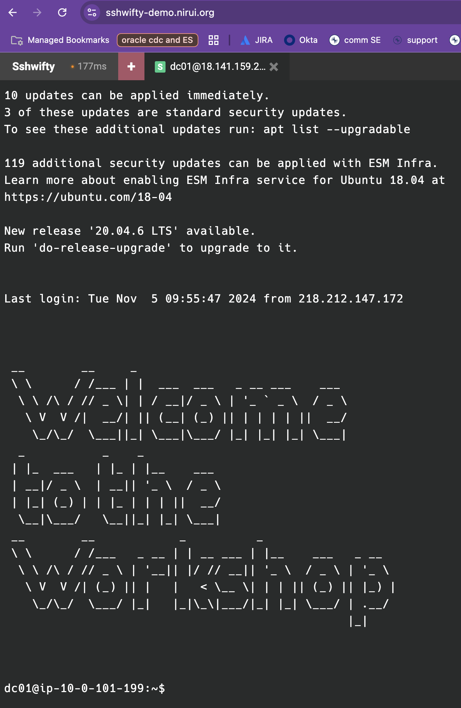
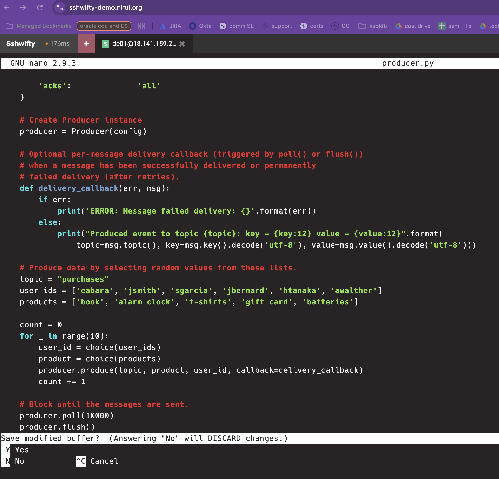
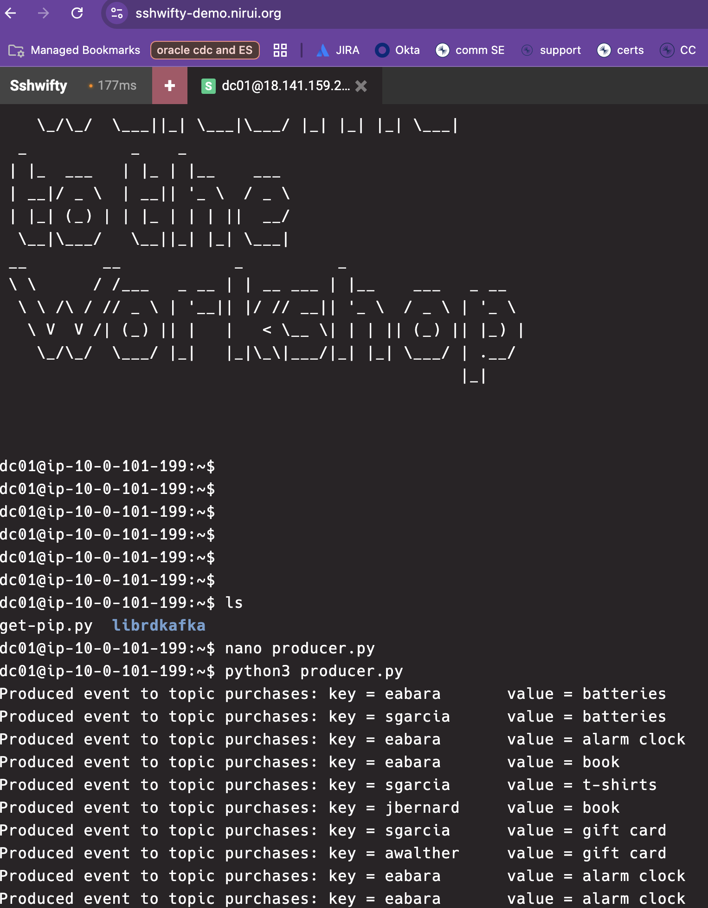
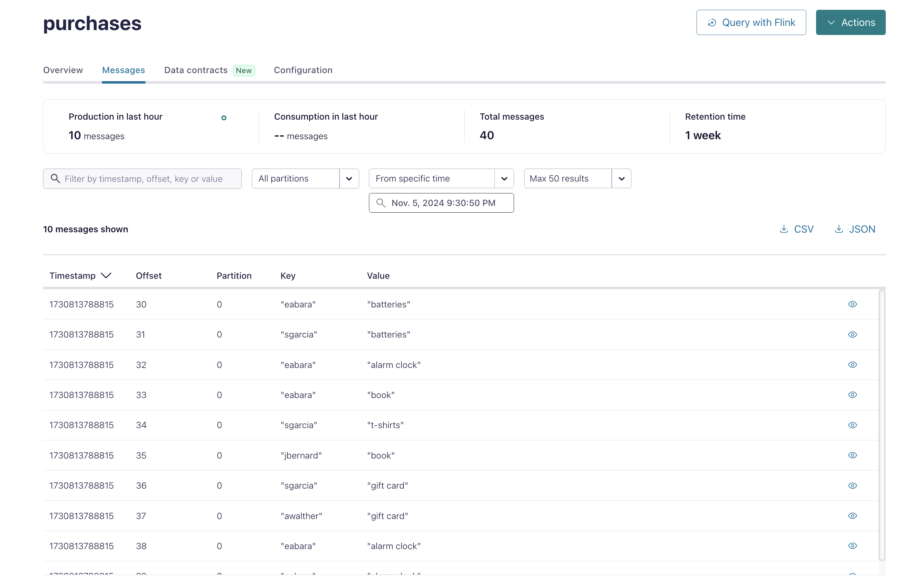
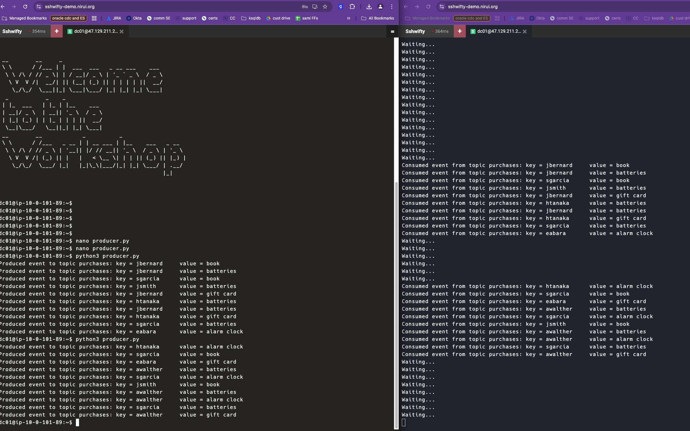

# Confluent Python Workshop

Welcome to the Confluent Python Workshop. This workshop will allow you to quickly get familiar with producing and consuming using the Confluent Python client library. For more details, visit the [Confluent Python client library documentation](https://docs.confluent.io/kafka-clients/python/current/overview.html). This repo is meant to be followed in concert with a Confluent technical instructor who will provide the SSH details required to log into a VM with preinstalled dependencies.

## Prerequisites

1. **Confluent Cloud Account**: [Sign up here](https://confluent.cloud/)
2. **Promo Code**: If provided by your instructor, apply it on the [Billing & payment page](https://confluent.cloud/settings/billing/payment) in the Confluent Cloud Console.
3. **VM Access**: Your instructor will provide a host (VM) for SSH access. Each participant will have their own VM.
4. **SSH Access**: Use [SSHwifty](https://sshwifty-demo.nirui.org/) if SSH is blocked on your machine.
5. **IDE**: Use an IDE like VSCode to jot down notes and code.

## Log into Confluent Cloud

1. Log into Confluent Cloud with your email and password.
2. If logging in for the first time, minimize the self-guided wizard as you will follow those steps in this workshop.

## Create an Environment and Cluster

An environment contains clusters and its deployed components such as Apache Flink, Connectors, ksqlDB, and Schema Registry. You can create different environments based on your company's requirements.

1. **Add Environment**: Click `+ Add Environment`, specify an Environment Name, and click `Create`.
    - Note: A default environment is available upon account creation. You can use this for the workshop.
    

2. **Create Cluster**: Click `Create Cluster`.
    - Note: Confluent Cloud clusters are available in 3 types: Basic, Standard, and Dedicated. Use Basic for the workshop.
    

3. **Cluster Configuration**:
    - Choose the Basic cluster type.
    - Click `Begin Configuration`.
    - Choose your preferred Cloud Provider (AWS, GCP, or Azure), region, and availability zone.
    - Specify a Cluster Name.
    

4. **Launch Cluster**: Review the Configuration & Cost, Usage Limits, and Uptime SLA information before launching. Click `Launch Cluster`.

## Confluent Cloud Dashboard

1. **Cluster Overview**: Shows Cluster Metrics such as Throughput and Storage, and the number of Topics, Partitions, Connectors, and ksqlDB Applications.
    

2. **Cluster Settings**: Find your Cluster ID, Bootstrap Server, Cloud Details, Cluster Type, and Capacity Limits. Copy your bootstrap server for later use.
    

## Create API Key and Secret

To interact with Confluent Cloud programmatically, create an API key and secret:

1. Navigate to the **API keys** section in the Confluent Cloud Console.
2. Click `+ Create Key`.
3. Select the scope `My Account`.
4. Click `Next`.
5. Review and download the API key and secret. Save them for later use.
    

## Create Topic

A topic is an immutable, append-only log of events. Create a topic for retail purchases:

1. Navigate to the **Topics** section in the Confluent Cloud Console.
2. Click `Create topic`.
3. Enter the topic details:
    - **Topic name**: `purchases`
    - **Partitions**: `1`
4. Click `Create with defaults`.
    

## SSH

SSH into your VM using the provided public IP, username, and password. Use the sshwifty browser tool:

1. Enter the host and user data provided by your instructor.
2. Select password authentication.
3. Click connect.
4. Enter the provided password.
    

If successful, you should see a welcome page.
    

## Confluent Python Client 

Create a Confluent Python producer:

1. In your IDE, create a file `producer.py`.
2. Paste the following contents into `producer.py`:

```python
#!/usr/bin/env python

from random import choice
from confluent_kafka import Producer

if __name__ == '__main__':

     config = {
          'bootstrap.servers': '<BOOTSTRAP SERVERS>',
          'sasl.username':     '<CLUSTER API KEY>',
          'sasl.password':     '<CLUSTER API SECRET>',
          'security.protocol': 'SASL_SSL',
          'sasl.mechanisms':   'PLAIN',
          'acks':              'all'
     }

     producer = Producer(config)

     def delivery_callback(err, msg):
          if err:
                print('ERROR: Message failed delivery: {}'.format(err))
          else:
                print("Produced event to topic {topic}: key = {key:12} value = {value:12}".format(
                     topic=msg.topic(), key=msg.key().decode('utf-8'), value=msg.value().decode('utf-8')))

     topic = "purchases"
     user_ids = ['eabara', 'jsmith', 'sgarcia', 'jbernard', 'htanaka', 'awalther']
     products = ['book', 'alarm clock', 't-shirts', 'gift card', 'batteries']

     for _ in range(10):
          user_id = choice(user_ids)
          product = choice(products)
          producer.produce(topic, product, user_id, callback=delivery_callback)

     producer.poll(10000)
     producer.flush()
```

3. Replace the bootstrap server, cluster API key, and secret with your own values.
4. Copy `producer.py` to your clipboard.
5. In sshwifty, create `producer.py` using a text editor like nano: `nano producer.py`.
6. Paste the contents and save the file. note: If you are using nano, then you can **ctrl+O** band **enter** 
    
7. Run the producer: `python3 producer.py`.
8. Verify data output in the terminal.
    

9. In the Confluent Cloud UI, navigate to the `purchases` topic and view the messages.
    

Create a Confluent Python consumer:

1. Now we will follow a similar process for the consumption of our messages. In your IDE, create a file `consumer.py`.
2. Paste the following contents into `consumer.py`:

```
#!/usr/bin/env python

from confluent_kafka import Consumer

if __name__ == '__main__':

    config = {
        # User-specific properties that you must set
        'bootstrap.servers': '<BOOTSTRAP SERVERS>',
        'sasl.username':     '<CLUSTER API KEY>',
        'sasl.password':     '<CLUSTER API SECRET>',

        # Fixed properties
        'security.protocol': 'SASL_SSL',
        'sasl.mechanisms':   'PLAIN',
        'group.id':          'kafka-python-getting-started',
        'auto.offset.reset': 'earliest'
    }

    # Create Consumer instance
    consumer = Consumer(config)

    # Subscribe to topic
    topic = "purchases"
    consumer.subscribe([topic])

    # Poll for new messages from Kafka and print them.
    try:
        while True:
            msg = consumer.poll(1.0)
            if msg is None:
                # Initial message consumption may take up to
                # `session.timeout.ms` for the consumer group to
                # rebalance and start consuming
                print("Waiting...")
            elif msg.error():
                print("ERROR: %s".format(msg.error()))
            else:
                # Extract the (optional) key and value, and print.
                print("Consumed event from topic {topic}: key = {key:12} value = {value:12}".format(
                    topic=msg.topic(), key=msg.key().decode('utf-8'), value=msg.value().decode('utf-8')))
    except KeyboardInterrupt:
        pass
    finally:
        # Leave group and commit final offsets
        consumer.close()
```
3. Replace the bootstrap server, cluster API key, and secret with your own values.
4. Copy `consumer.py` to your clipboard.
5. Open up a new tab in your browser to create a separate sshwifty instance, refer to the "SSH" section above for a refresher on how to connect to your VM in the new sshwifty tab. 

6. create `consumer.py` using a text editor like nano: `nano consumer.py`.
7. Paste the contents of your clipboard for the `consumer.py` and save the file. note: If you are using nano, then you can **ctrl+O** and **enter** 

8. Now you can produce a few messages in one sshwifty window, and have the consumption happen in realtime. 
9. First run the consumer: `python3 consumer.py` in one window. 
10. Now in the other window, launch the producer and watch the messages appear on the consumption window i.e. 
    